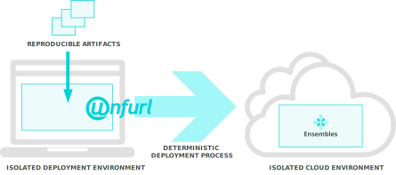

## Concepts

At the core of Unfurl is an `Ensemble` manifest, a YAML file that includes:

* A model of the cloud resources it manages (using the OASIS's [TOSCA](tosca) 1.3 ("Topology and Orchestration Specification for Cloud Applications") standard)
* Implementations of operations and workflows that can be applied to those resources (via `configurators`)
* A record of the operational status of those resources.

Ensembles can be part of an Unfurl project that manages one or more git repositories which contain code, artifacts, configuration and operational history. 

The main job of Unfurl is apply the workflows in the Ensemble and record the results. It creates a change log tracking which operations were applied to which resources and how those resources where changed. These changes can be committed to `git` automatically so that each commit represents an update to the state of the system.

While the implementation of operations can be specified natively in Unfurl, it is primarily intended as a coordinator of existing build and deployments tools, and in particular Terraform and Ansible. As such, Unfurl lets you mix and match both declarative and imperative approaches in the same project, and carefully designed, fine-grained models can live alongside course-grained objects  with ad-hoc metadata and dynamically generated configuration.

### Ensembles "in theory"

Take the isolation of containers and apply to live services: clone, relocate...  

An ensemble is a "deep" representation of the implementation of a live service.

  * reproducible: To see it like a function in a compute program: given inputs that meet some set of constraints, an ensemble consistently produce outputs that conforms to some set of invariants.
  * Type signature
  * persistent, independent identity
  * Operational state
  * History and lineage
  * Isolation: both host and target

Goals:
  * Minimal privileges
  * Relocatable
  * Traceable
  * Auditable

Unfurl's philosophy is to treat ensembles as persistent, first-class objects with type signature and metadata. They maintain their identity even as their configuration changes. This allows dependencies between ensembles to be tracked and makes it easier to diagnose incompatibilities and misconfigurations. For example, if the domain name of the ensemble's website changes, dependent ensembles with configuration that uses URL to the website can be updated.

* Ensembles as first class objects
  * Encapsulation:
  - public interfaces
  - private implementation
  * persistent identity regardless of where and how it is hosted
  * capabilities-based security
  * formal type system (TOSCA standard)
  * match by type and constraints
  
* abstractions that span across protocol layers and technologies
* two ensembles with the same identifier have the state and data
* maintains changeid that represents state and configuration and is comparable

### Ensemble Manifest

  The status is presented as an hierarchy of the operational status and attributes of live resources created, modified or observed by deploying and managing the project.
